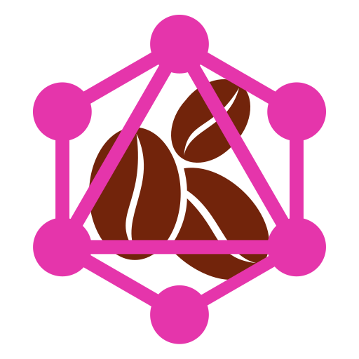

<p align="center">
   
</p>

# graphlatte

> Next.js template with GraphQL, Urql, Prisma, Nexus and Tailwind

## What is in Graphlatte

1. [`GraphQL Helix`](https://github.com/contra/graphql-helix) for handling requests
2. Nexus with Prisma [`(nexus-prisma)`](https://github.com/prisma/nexus-prisma)
3. [`GraphQL Codegen`](https://www.graphql-code-generator.com/)
   - TypedDocumentNode
   - Near operation files
4. [`Tailwind`](https://tailwindcss.com/) with a base configuration and [`Tailwind Prettier Plugin`](https://github.com/tailwindlabs/prettier-plugin-tailwindcss)
5. Docker Compose for local Postgres database
6. On-save Code generation with VSCode plugin [`Save and Run`](https://marketplace.visualstudio.com/items?itemName=wk-j.save-and-run)
7. Next.js built-in ESLint integration
8. Easy global typing with [`definitions.d.ts`](https://github.com/graphlatte/graphlatte/blob/main/src/config/definitions.d.ts) file (e.g. typing .env)
9. Using [`iron-session`](https://github.com/vvo/iron-session) for authentication/session handling
10. [`Envelop`](https://github.com/dotansimha/envelop) included

## Installation

- There are two main options to create a new project with Graphlatte

1. `Use this template` directly on GitHub

   - https://github.com/graphlatte/graphlatte/generate

2. Or clone with `git`

In your terminal

```bash
git clone https://github.com/graphlatte/graphlatte.git project-name
cd project-name
```

### Install dependencies, generate code and run

With yarn

```bash
yarn
yarn generate:env
yarn dev
```

Or with npm

```bash
npm install
npm run generate:env
npm run dev
```

- Graphlatte comes with a base `docker-compose` file for running local Postgres

#### Requires installed and running [`Docker`](https://docs.docker.com/get-docker).

##### The data between Docker restarts are saved in ./docker/postgres folder, that can be changed in the [Compose file](./docker-compose.yml)

```bash
yarn db

# or
npm run db
```

- You can also use something like [`Concurrently`](https://github.com/kimmobrunfeldt/concurrently) to run the `next dev` and `docker-compose` in one command

```jsonc
// package.json
{
  // ...
  "scripts": {
    "dev": "concurrently \"next\" \"docker-compose\""
  }
}
```

> This will install dependencies, generate Prisma schema + example .env file and start the Next development server

- Prisma schema gets regenerated after every yarn/npm add or install.

## Deployment

### Hosting

Recommended hosting choice is [Vercel](https://vercel.com/), which works well with Graphlatte.

#### You can also run Graphlatte [on your server behind Nginx reverse proxy](https://gist.github.com/kocisov/2a9567eb51b83dfef48efce02ef3ab06).

### Database

- [Railway](https://railway.app/) (only US regions right now)
- [Supabase](https://supabase.io/) (where you can also use PgBouncer just by adding ?pgbouncer=true flag https://supabase.io/blog/2021/04/02/supabase-pgbouncer 🤯 )

- Any Cloud Provider

  - with DBaaS like Cloud SQL on GCP or RDS on AWS, ...
  - or with VM (you will need to set up the database yourself)

## Thanks

Big thanks to [huv1k](https://github.com/huv1k).

If you would like to use Next-Auth, Dependabot and configure GraphQL Codegen differently (e.g. use generated urql hooks), check out his great boilerplate https://github.com/huv1k/nextjs-auth-prisma.

## License

The MIT License.
